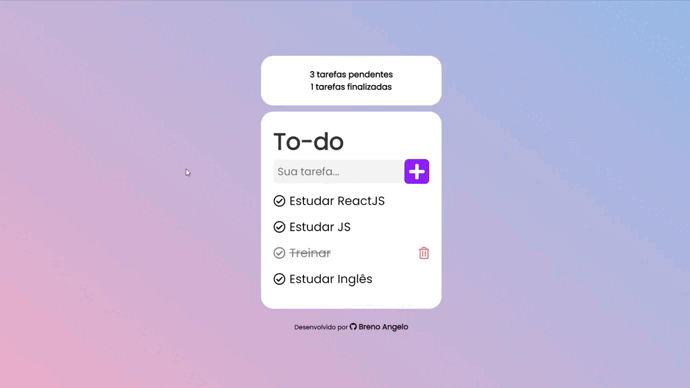

<h1 align="center">
    <a href="https://tarefas-c9ee5.web.app">To-do</a>
</h1>
<p align="center">Um app para organizar tarefas.</p>

<h1 align="center">
  
</h1>

<!--ts-->
   <p align="center">
     <a href="#recursos">Recursos</a> • 
     <a href="#tecnologias">Tecnologias</a> • 
     <a href="#contribuicao">Como instalar</a> • 
     <a href="#autor">Autor</a>
  </p>
<!--te-->

<h4 align="center"> 
	🚧  React Select 🚀 Em construção...  🚧
</h4>

<h3 id="recursos">Recursos</h3>

- [x] Adicionar Tarefa
- [x] Remover Tarefa
- [x] Concluir Tarefa
- [ ] Lembrete de Tarefa
- [ ] Dias da semana

<h3 id="tecnologias">Tecnologias</h3> 

- ReactJS
- Scss
- Fontawesome
- Firebase

<h3 id="contribuicao">Como instalar</h3>

### Pré-requisitos

Antes de começar, você vai precisar ter instalado em sua máquina as seguintes ferramentas:
[Git](https://git-scm.com), [Node.js](https://nodejs.org/en/). 
Além disto é bom ter um editor para trabalhar com o código como [VSCode](https://code.visualstudio.com/)

### 🎲 Rodando o App

```bash
# Clone este repositório
$ git clone <https://github.com/brenoangelo/todolist.git>

# Acesse a pasta do projeto no terminal/cmd
$ cd todolist

# Instale as dependências
$ npm install

# Execute a aplicação em modo de desenvolvimento
$ npm start

# O servidor inciará na porta:3000 - acesse <http://localhost:3000>
```

<p id="autor">Feito ♥ por Breno Angelo</p>
